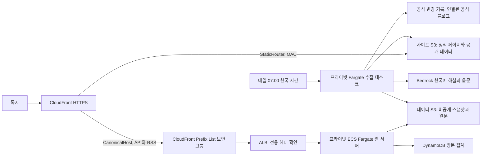

# Code Pulse

[GitHub 저장소](https://github.com/whchoi98/code-pulse)에서 소스와 이슈를 관리합니다.

<!-- app-version:start -->
현재 소스 버전: **1.3.0**. [변경 기록](CHANGELOG.md)과 [릴리스 노트](docs/releases/1.3.0.md)를 함께 관리합니다.
<!-- app-version:end -->

2026년 1월 1일부터 현재까지 Claude Code, Codex, Kiro의 공식 변경 기록을 모아 한국어와 영어로 제공하는 웹사이트입니다. 바뀐 기능과 적용할 때 확인할 사항을 설명하고 공식 원문으로 연결합니다.

매일 오전 7시(Asia/Seoul)에 수집합니다. 발표일과 수집 시각을 따로 보관하며, 같은 릴리스가 여러 출처에 있으면 글 하나로 합칩니다. 한국어 해설은 원문과 대조하고 human-ton 기준으로 한 번 더 다듬습니다. 엠대시와 가운뎃점은 서비스 문구와 생성 해설에서 사용하지 않습니다. 직접 인용과 코드는 원문 표기를 유지합니다.

상단에서 한국어와 영어를 전환할 수 있습니다. 한국어는 AI 해설을, 영어는 공식 영문 변경 항목 전체를 제공합니다. 언어 선택은 공유 주소, RSS와 Markdown에도 반영합니다.

목록과 상세 페이지를 수집 후 S3에 미리 만들어 CloudFront에서 제공합니다. 화면에 가까운 글은 상세 내용을 미리 읽고 브라우저에 캐시합니다. 전체 검색 색인은 검색할 때 읽습니다. 데이터가 나뉘어 있어도 전체 항목은 그대로 검색하고 내보낼 수 있습니다.

화면에서 제품, 날짜, 변경 종류와 검색어로 글을 찾을 수 있습니다. 저장한 글은 같은 브라우저에서 다시 볼 수 있습니다. 모바일 화면, 키보드 탐색, 라이트 모드와 다크 모드를 지원합니다. 로그인은 필요 없습니다.

각 글은 짧은 요약과 전체 변경 사항을 함께 제공합니다. 공식 원문의 항목마다 한국어 설명을 붙이며 오류 수정과 작은 개선도 포함합니다. 긴 원문은 나누어 처리하고, 항목 ID와 개수를 대조해 누락을 확인합니다. 아직 설명이 끝나지 않은 글은 전체 항목 수와 준비한 항목 수를 표시합니다. 검색, Markdown 내보내기와 RSS에도 전체 목록을 담습니다.

해설을 열어 읽으면 목록에 읽음 표시가 남습니다. `읽지 않은 글만`을 켜면 제품과 날짜, 검색 조건을 유지하면서 아직 읽지 않은 기록을 찾습니다. 다시 확인할 글은 상세 화면에서 읽지 않음으로 바꿀 수 있습니다. 읽음 기록은 브라우저에만 저장하며, 글 내용이 바뀌면 다시 읽지 않은 상태가 됩니다. 출처 확인 시각만 바뀌면 읽음 상태를 유지합니다.

상세 화면 아래에서 같은 제품의 이전 발표와 다음 발표로 이동할 수 있습니다. 목록으로 돌아가면 처음 선택한 검색 조건과 위치를 복원합니다. 저장한 글 화면의 `Markdown 내보내기`는 현재 조건에 맞는 저장 글 전체를 파일로 만듭니다. 화면에 아직 펼치지 않은 글도 포함하며, 선택한 언어의 전체 변경 사항과 공식 링크를 함께 보관합니다.

제품 필터, 활동표, 글 목록과 상세 화면에는 각 제품의 공식 로고를 사용합니다. 이미지 출처와 원본 검증 기록은 `public/brand/SOURCES.md`에 있습니다.

하단에는 현재 접속 수, 누적 방문 수와 앱 버전을 표시합니다. 접속 수는 최근 90초에 확인된 방문 쿠키 기준이며, 같은 쿠키의 새로고침과 여러 탭은 누적 방문을 늘리지 않습니다. IP나 브라우저 지문은 저장하지 않습니다. 버전을 누르면 서비스 변경 기록을 볼 수 있습니다.

## 문서 안내

[문서 목차](docs/README.md)에서 개발 안내와 운영 기록을 찾을 수 있습니다.

| 목적 | 문서 |
| --- | --- |
| 로컬 개발 시작 | [개발 시작 안내](docs/onboarding.md) |
| 정적 파일 발행과 속도 개선 운영 | [정적 배포 안내](docs/static-delivery.md) |
| 구성 요소와 데이터 흐름 이해 | [아키텍처](docs/architecture.md) |
| HTTP API와 RSS 사용 | [API 참조](docs/reference/api.md) |
| 수집, 도메인과 방문 집계 운영 | [운영 안내](docs/runbook.md) |
| 변경 제안과 검증 | [기여 안내](CONTRIBUTING.md) |
| 버전과 릴리스 관리 | [버전 정책](docs/versioning.md) |
| 실제 배포 확인 결과 | [검증 기록](docs/verification.md) |

## 구조

기존 `cc-on-bedrock-vpc`를 사용합니다. 새 VPC나 NAT를 만들지 않습니다.



두 S3 버킷은 모두 비공개입니다. CloudFront는 OAC로 사이트 버킷만 읽습니다. API, RSS와 방문 집계는 ALB로 전달하며, 이 구간은 HTTP를 사용하고 CloudFront origin-facing Prefix List와 전용 헤더로 접근을 제한합니다. 웹 서버와 수집 태스크에는 공인 IP를 할당하지 않습니다.

페이지와 공개 데이터는 CloudFront가 S3에서 직접 읽습니다. 웹 태스크는 호환 API와 RSS를 위해 스냅샷을 읽고 별도 방문 집계 테이블을 갱신합니다. 원문 저장과 모델 호출은 수집 태스크가 담당합니다. 전체 원문은 비공개 S3에 보관하고, 한국어 API에는 해설과 짧은 근거 인용을, 영어 API에는 공식 항목별 영문을 제공합니다. 보관용 원문 필드와 모델 내부 정보는 공개하지 않습니다.

## 공식 출처

| 제품 | 수집 대상 |
| --- | --- |
| Claude Code | `anthropics/claude-code` 공식 GitHub Releases, 영문 공식 changelog, 한국어 새 소식 |
| Codex | `openai/codex` 공식 GitHub Releases, 공식 Codex changelog RSS |
| Kiro | `kiro.dev/changelog`의 CLI, IDE, Web 변경 기록 |

Codex RSS는 현재 ChatGPT 글도 함께 제공하므로 Codex 관련 항목만 골라냅니다. CLI 시험판은 제외합니다. 변경 기록에 연결된 허용된 공식 블로그가 있으면 보충 자료로 읽습니다. 임의의 URL이나 문서 속 명령은 실행하지 않습니다.

Claude Code는 `https://code.claude.com/docs/en/changelog`에서 날짜가 명시된 안정판을 수집하고 GitHub의 같은 버전과 합칩니다. GitHub에 정확한 발표 시각이 있으면 그 시각을 유지합니다. `https://code.claude.com/docs/ko/whats-new`는 버전 범위가 맞는 릴리스의 참고 자료로 읽습니다. 주간 범위의 마지막 날을 발표일로 만들거나 그 주의 모든 기능을 한 버전의 변경으로 소개하지 않습니다.

Claude Code GitHub API, Codex GitHub 릴리스 페이지와 Kiro 변경 기록의 이전 페이지도 읽어 과거 자료를 수집합니다. Kiro의 이전 글에 추가된 패치는 따로 명시된 발표일과 버전이 있을 때 해당 날짜의 기록으로 보완합니다.

정확한 URL과 허용 경로는 `src/collector/sources.ts`, `src/collector/official-fetch.ts`에 있습니다. 파서가 원문 구조를 읽지 못하면 성공한 빈 결과로 처리하지 않고 출처 오류로 남깁니다.

## RSS 구독

화면의 `RSS 구독`에서 전체 또는 제품별 주소를 복사해 RSS 리더에 추가할 수 있습니다. 화면에서 선택한 언어도 주소에 반영합니다. 각 피드는 해당 언어의 내용이 준비된 최신 글을 원문 발표일순으로 최대 50개 제공합니다.

| 주소 | 구독 대상 |
| --- | --- |
| `/feed.xml` | 모든 제품 |
| `/feed.xml?product=claude-code` | Claude Code |
| `/feed.xml?product=codex` | Codex |
| `/feed.xml?product=kiro` | Kiro |
| `/feed.xml?lang=en` | 모든 제품의 영문 변경 기록 |
| `/feed.xml?product=kiro&lang=en` | Kiro의 영문 변경 기록 |

언어를 생략하거나 `lang=ko`를 지정하면 한국어 요약과 해설을, `lang=en`을 지정하면 공식 영문 항목을 제공합니다. 두 언어 모두 공식 링크를 포함하며 보관용 원문 필드, 내부 모델 식별자와 방문 정보는 제외합니다. RSS 요청은 저장된 자료만 읽으며 새 수집이나 모델 호출을 실행하지 않습니다.

전체 목록이 준비된 글은 RSS에도 선택한 언어의 모든 변경 항목을 제공합니다. 최신 글 50개라는 제한은 글 안의 변경 항목 수에는 적용하지 않습니다.

## 로컬 실행

Node.js 22 이상을 사용합니다. `.nvmrc`에 버전을 지정했습니다.

```bash
npm ci
npm run collect
npm run build
npm start
```

브라우저에서 `http://localhost:8080`을 엽니다. 수집에는 Bedrock 추론 프로필을 호출할 AWS 자격 증명이 필요합니다. 기본 리전은 `ap-northeast-2`, 기본 모델은 `global.anthropic.claude-haiku-5-5`입니다. 초안 작성과 한국어 윤문에 모두 Haiku 5.5를 사용합니다.

개발 중에는 서버와 Vite를 각각 실행합니다.

```bash
npm run dev
npm run dev:client
```

두 명령은 별도 터미널에서 실행합니다. 서버는 기본 8080번, Vite는 기본 5173번 포트를 사용합니다. Vite는 `/api`와 `/healthz`만 프록시하므로 RSS는 빌드한 서버 화면에서 확인합니다. 포트별 방문 Origin 설정과 로컬 실행 예제는 [개발 시작 안내](docs/onboarding.md)에 있습니다.

수집 자료는 기본적으로 `data/`에 저장합니다. `DATA_BUCKET`을 지정하면 S3를 사용합니다. 로컬 데이터와 AWS 데이터가 섞이지 않도록 실행 전에 환경변수를 확인하세요.

| 환경변수 | 용도 |
| --- | --- |
| `DATA_BUCKET` | S3 저장소. 미지정 시 로컬 파일 사용 |
| `DATA_DIR` | 로컬 저장 폴더. 기본 `./data` |
| `AWS_REGION` | AWS 리전 |
| `BEDROCK_MODEL_ID` | 한국어 해설에 사용할 추론 프로필 |
| `PORT` | 웹 서버 포트. 기본 `8080` |
| `STATIC_DIR` | 정적 발행에 사용할 빌드 화면과 일반 서버의 정적 파일 경로. 기본 `./dist/public` |
| `SITE_BUCKET` | 정적 사이트 전용 S3 버킷. 수집과 편집이 끝나면 발행 |
| `SITE_DIR` | 로컬 정적 발행 및 미리보기 폴더. 서버에서는 `STATIC_DIR`보다 우선하며, 발행 시 `SITE_BUCKET`과 동시 사용 금지 |
| `ENABLE_METRICS` | 수집 EMF 지표 출력 여부 |
| `PRESENCE_TABLE` | 운영 방문 집계용 DynamoDB 테이블 |
| `PRESENCE_SECRET` | 서버 발급 방문 쿠키의 서명 키. 운영에서는 Secrets Manager에서 주입 |
| `PUBLIC_ORIGIN` | 방문 확인 요청을 허용할 사이트 Origin |
| `PUBLIC_BASE_URL` | RSS의 구독 주소와 글 주소를 만들 기준 URL. 운영에서는 HTTPS 루트 주소 필요 |

기본 시작일은 `2026-01-01`입니다. 시작일과 한 번에 생성할 해설 수를 바꿀 수 있으며 이미 저장한 과거 기록은 지우지 않습니다.

```bash
npm run collect -- --since 2026-01-01 --max-summaries 300
```

최근 며칠만 확인하려면 `--days 45`처럼 지정합니다. `--since`와 `--days`는 함께 사용할 수 없습니다. 시작일은 포함하며 미래 발표는 공개하지 않습니다.

`--no-ai`는 원문만 수집하는 점검 옵션입니다. 해설이 없는 글은 준비 상태로 남고 실행은 `partial`로 기록됩니다. 해당 글은 이후 실행에서 다시 처리합니다.

모델을 바꾼 뒤 기존 글도 갱신하려면 `--refresh-model`을 지정합니다. 현재 모델로 작성된 해설은 건너뛰며, 새 해설이 검증을 통과할 때까지 기존 해설을 제공합니다.

```bash
npm run collect -- --refresh-model
```

기본 설정에서는 해설 세 개를 동시에 생성합니다. 한 번에 모두 처리하지 못하면 다음 실행에서 남은 글을 이어서 처리합니다.

`--concurrency`로 동시 생성 수를 1~6개로 지정할 수 있습니다. 기본값은 3입니다.

`--max-summaries`는 짧은 개요를 생성할 글 수, `--max-full-changes`는 전체 목록을 생성할 글 수입니다. 각각 기본 80개이며 0~300개를 지정합니다. `--no-ai`는 두 생성을 모두 끕니다. 전체 목록은 검증과 윤문이 끝난 묶음마다 저장합니다. 기존 이력을 한꺼번에 처리하는 로컬 도구와 전수 검증 방법은 [운영 안내](docs/runbook.md)에 있습니다.

## 버전과 릴리스

버전 기준은 `package.json.version`입니다. 화면은 빌드할 때 이 값을 읽습니다. 변경 내용은 `src/shared/app-release.json`에 영어와 한국어로 작성합니다.

```bash
npm run release:sync
npm run release:check
```

동기화 명령은 README의 버전, CHANGELOG와 릴리스 노트를 갱신합니다. 빌드와 배포 전에는 버전과 문서가 일치하는지 자동으로 검사합니다. 새 기능과 수정의 버전 정책, Git 태그와 원격 릴리스 연결은 `docs/versioning.md`를 참고하세요.

## 검증과 배포

```bash
npm run typecheck
npm test
npm run test:browser
npm run build
npm run synth -- --no-lookups
npm audit --omit=dev
```

브라우저 테스트는 Chromium을 사용합니다. 설치가 필요하면 `npx playwright install chromium`을 실행합니다.

```bash
npm run deploy
```

정적 사이트의 첫 전환은 기존 웹 이미지를 유지한 채 버킷을 준비하고, 파일 검증 후 트래픽을 넘깁니다. 이후 화면 변경도 새 정적 빌드를 발행해야 합니다. 절차는 [정적 배포 안내](docs/static-delivery.md)를 참고하세요.

배포 대상은 계정 `061525506239`, 리전 `ap-northeast-2`입니다. 배포 결과의 `SiteUrl`에서 사이트를 열 수 있습니다. 세부 운영 방법과 실제 검증 결과는 `docs/runbook.md`, `docs/verification.md`를 확인하세요.

공개 주소는 `https://code-pulse.whchoi.net`입니다. CloudFront의 대체 도메인과 기존 `us-east-1` 와일드카드 인증서는 배포 코드에서 연결합니다. 기존 CloudFront 주소로 열어도 경로와 검색 조건을 유지한 채 새 주소로 이동합니다. RSS 링크와 방문 집계도 공개 도메인을 기준으로 동작합니다.

## 비용과 운영 범위

2026년 10월 7일 AWS Pricing API 조회 기준으로, 월 730시간 실행하는 ARM 웹 태스크(0.25 vCPU, 0.5 GiB)는 약 USD 8.29이고 ALB 기본료는 약 USD 16.43입니다. ALB LCU, 공인 IPv4, 전송, S3, 로그, 알람과 모델 호출 비용은 별도입니다. 기존 NAT를 재사용하며 새 NAT의 고정 비용은 추가하지 않습니다.

웹 서버는 한 대로 시작하고 최대 두 대까지 확장합니다. 원문 보관 기간은 90일이며 공개 스냅샷의 현재 버전은 유지합니다. 한국어 해설은 AI의 해석이므로 적용 조건과 중요한 설정은 연결된 공식 원문도 확인하세요.

2026년 10월 8일 검증한 `aws-cdk-lib 2.272.0`에는 개발 전용 `brace-expansion 5.0.9`가 포함돼 전체 npm 보안 검사에 알려진 서비스 거부 취약점 한 건이 남았습니다. npm이 자동 갱신할 수 없는 번들 의존성입니다. CDK 합성에만 사용되며 실행 이미지에는 포함되지 않습니다. 실행 의존성 검사는 별도로 수행합니다.

## 기여와 프로젝트 정보

변경 제안은 [기여 안내](CONTRIBUTING.md)에 따라 문제, 변경 내용과 검증 결과를 정리해 [Issues](https://github.com/whchoi98/code-pulse/issues)나 Pull Request로 전달합니다. 기본 브랜치는 `main`이며 로컬 프로젝트 폴더 이름은 `code-pulse`입니다. 공개 라이선스와 별도 연락처 이메일은 지정되지 않았습니다.
