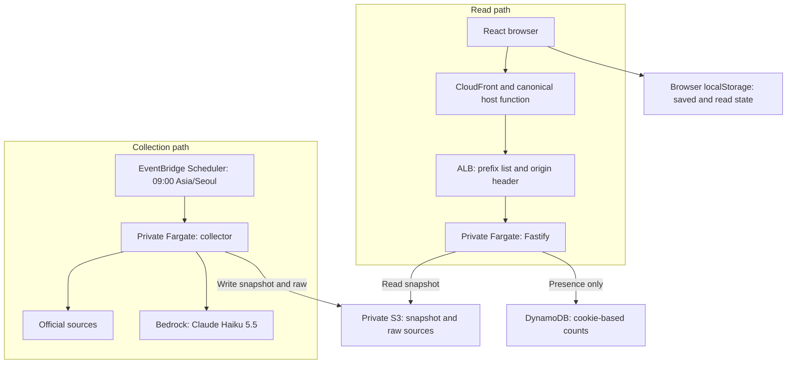

# Code Pulse architecture

 

## English

### Components and data flow

Code Pulse separates reading from collection. React renders published records, Fastify serves the website and APIs, and a separate collector fetches official material and generates Korean explanations. Shared response types are defined in [types.ts](../src/shared/types.ts).

| Component | Responsibility | Source |
| --- | --- | --- |
| Browser | Filter and read records, save IDs, track content revisions, export Markdown and copy RSS URLs | [App](../src/client/App.tsx), [reading](../src/client/reading.ts), [export](../src/client/export.ts) |
| HTTP server | Serve static files, public feed, entry details, RSS and health status | [app](../src/server/app.ts), [RSS](../src/server/rss.ts) |
| Presence | Sign browser cookies, update first-visit markers and count activity within 90 seconds | [API](../src/server/presence.ts), [store](../src/server/presence-store.ts) |
| Collector | Read official sources, preserve dates, deduplicate releases, generate and validate explanations | [engine](../src/collector/engine.ts), [sources](../src/collector/sources.ts), [explanation](../src/collector/explanation.ts) |
| Snapshot store | Use local files or `published/snapshot.json` in S3; archive raw material separately | [store](../src/collector/store.ts) |
| Deployment | Import the existing network and configure edge, tasks, storage and schedule | [stack](../infra/lib/stack.ts), [Dockerfile](../Dockerfile) |

### Boundaries and recovery

The web task can read `published/*` in S3 and write its separate presence table. It cannot generate explanations or write published content. The collector can update the snapshot and archive sources, but it has no presence-table permissions.

Collection begins at `2026-01-01` by default. Publication dates, source checks and editorial times are separate fields. Failed sources preserve earlier records; failed explanations remain pending. Haiku 5.5 drafts and polishes the explanation, and validation checks source evidence before publication. S3 uses ETag conditions; local files use a lock and atomic replacement. See the [runbook](runbook.md) for retries, checkpoints and historical collection.

The server caches a snapshot for 60 seconds. A storage failure serves the previous cached snapshot with `no-store`; without a readable snapshot it returns 503. Feed freshness also considers each source's last successful check. RSS includes at most 50 ready records and keeps their original publication dates.

Each record also stores a complete ordered inventory in `fullChanges`, separate from the short overview. [Extraction](../src/collector/change-items.ts) preserves every source item; [generation](../src/collector/full-changes.ts) fills the IDs in bounded batches with a separate polish pass. Full readiness requires the current source hash, model and format plus exact item coverage. [Public serialization](../src/server/public-entry.ts) removes the source hash and model and recomputes the current inventory status. Search, read revisions, Markdown and RSS consume the full Korean list.

Read state and saved IDs stay in browser storage. Rechecking a source alone does not reset read state; visible content changes do. Markdown export runs in the browser. Visitor counts instead use signed cookies and persistent DynamoDB records, with a separate permanent first-visit marker and an expiring activity record. Local development uses an in-memory presence store.

### Deployment constraints

The stack imports the existing VPC and subnets in `ap-northeast-2`. CloudFront accepts HTTPS for `code-pulse.whchoi.net` with the existing `us-east-1` wildcard certificate. Its function redirects alternate-host GET/HEAD requests while preserving path and query values. The same canonical URL supplies RSS links and the web presence Origin.

CloudFront connects to the ALB over HTTP. The ALB admits the CloudFront prefix list and requires a separate origin header; its default action is 403. Fargate tasks use private subnets without public IPs. The web service starts with one ARM64 task and scales to two. HTML and the public API share one custom cache policy; `/api/presence` uses disabled caching and forwarded viewer headers.

These choices are implemented in the stack. The [verification record](verification.md) distinguishes deployed observations from source intent; the [initial design](superpowers/specs/2026-10-07-code-pulse-design.md) preserves earlier decision context. Use [onboarding](onboarding.md), the [API reference](reference/api.md) and the [version workflow](versioning.md) for the corresponding procedures.

## 한국어

### 구성 요소와 데이터 흐름

Code Pulse는 조회와 수집을 나누어 실행합니다. React는 공개 기록을 표시하고 Fastify는 웹사이트와 API를 제공합니다. 별도 수집기가 공식 자료를 읽고 한국어 해설을 만듭니다. 공통 응답 타입은 [types.ts](../src/shared/types.ts)에 정의합니다.

| 구성 요소 | 역할 | 소스 |
| --- | --- | --- |
| 브라우저 | 기록 필터와 조회, 글 ID 저장, 내용 변경에 따른 읽음 상태 관리, Markdown 내보내기와 RSS 주소 복사 | [App](../src/client/App.tsx), [읽음 상태](../src/client/reading.ts), [내보내기](../src/client/export.ts) |
| HTTP 서버 | 정적 파일, 공개 피드, 상세 글, RSS와 건강 확인 제공 | [app](../src/server/app.ts), [RSS](../src/server/rss.ts) |
| 방문 집계 | 브라우저 쿠키 서명, 첫 방문 표식 저장, 최근 90초 활동 집계 | [API](../src/server/presence.ts), [저장소](../src/server/presence-store.ts) |
| 수집기 | 공식 출처 조회, 날짜 보존, 릴리스 중복 제거, 해설 생성과 검증 | [엔진](../src/collector/engine.ts), [출처](../src/collector/sources.ts), [해설](../src/collector/explanation.ts) |
| 스냅샷 저장소 | 로컬 파일 또는 S3의 `published/snapshot.json` 사용, 원문 별도 보관 | [저장소](../src/collector/store.ts) |
| 배포 | 기존 네트워크 참조와 엣지, 태스크, 저장소, 일정 설정 | [스택](../infra/lib/stack.ts), [Dockerfile](../Dockerfile) |

### 권한과 장애 처리

웹 태스크는 S3의 `published/*`를 읽고 별도 방문 테이블을 갱신합니다. 해설 생성과 공개 데이터 쓰기 권한은 없습니다. 수집기는 스냅샷과 원문을 저장하며 방문 테이블에는 접근하지 않습니다.

기본 수집 시작일은 `2026-01-01`입니다. 발표일, 출처 확인 시각과 편집 시각은 별도 필드로 보관합니다. 출처를 읽지 못하면 이전 기록을 유지하고, 해설 생성에 실패한 글은 준비 상태로 남깁니다. Haiku 5.5가 초안과 윤문을 수행하며 공개 전에 원문 근거를 검사합니다. S3는 ETag 조건부 쓰기를, 로컬 파일은 잠금과 원자적 교체를 사용합니다. 재시도, 중간 저장과 과거 자료 수집은 [운영 안내](runbook.md)를 참고합니다.

서버는 스냅샷을 60초 동안 캐시합니다. 저장소를 읽지 못하면 이전 캐시를 `no-store`로 제공하고, 읽을 수 있는 스냅샷이 없으면 503을 반환합니다. 피드의 최신성은 출처별 마지막 성공 시각도 확인합니다. RSS에는 해설이 준비된 글을 최대 50개 담으며 원문 발표일을 유지합니다.

각 글은 짧은 개요와 별도로 `fullChanges`에 원문 순서의 전체 목록을 저장합니다. [추출기](../src/collector/change-items.ts)가 모든 항목을 보존하고, [생성기](../src/collector/full-changes.ts)가 나누어 설명한 뒤 별도로 윤문합니다. 현재 원문의 해시, 모델과 형식이 맞고 모든 ID가 설명에 연결돼야 완료입니다. [공개 응답 처리](../src/server/public-entry.ts)는 원문 해시와 모델을 제외하고 현재 항목 기준으로 상태를 확인합니다. 검색, 읽음 변경 표식, Markdown과 RSS도 전체 한국어 목록을 사용합니다.

읽음 상태와 저장한 글 ID는 브라우저에 보관합니다. 출처를 다시 확인한 것만으로 읽음 상태를 초기화하지 않으며, 표시 내용이 바뀌면 읽지 않은 글로 돌아갑니다. Markdown 파일도 브라우저에서 만듭니다. 방문 집계는 서명 쿠키와 DynamoDB를 사용하고, 영구 첫 방문 표식과 만료되는 활동 기록을 나누어 저장합니다. 로컬 개발의 방문 집계는 메모리 저장소를 사용합니다.

### 배포 조건

스택은 `ap-northeast-2`의 기존 VPC와 서브넷을 참조합니다. CloudFront는 기존 `us-east-1` 와일드카드 인증서로 `code-pulse.whchoi.net`의 HTTPS 연결을 처리합니다. 다른 호스트로 들어온 GET/HEAD는 경로와 검색 조건을 유지해 공개 도메인으로 이동시킵니다. RSS 링크와 웹 방문 Origin도 같은 주소를 사용합니다.

CloudFront와 ALB 사이는 HTTP로 연결합니다. ALB는 CloudFront Prefix List의 접근만 받고 별도 원본 헤더를 확인하며, 기본 응답은 403입니다. Fargate 태스크는 공인 IP 없이 프라이빗 서브넷에서 실행합니다. 웹 서비스는 ARM64 태스크 한 개로 시작해 두 개까지 확장합니다. HTML과 공개 API는 사용자 정의 캐시 정책 하나를 공유하며, `/api/presence`는 캐시를 끄고 뷰어 헤더를 전달합니다.

이 구성은 스택 코드에 구현돼 있습니다. [검증 기록](verification.md)은 실제 배포 결과를 구분해 남기며, [초기 설계](superpowers/specs/2026-10-07-code-pulse-design.md)는 이전 결정의 배경을 보존합니다. 실행 절차는 [개발 시작 안내](onboarding.md), [API 참조](reference/api.md), [버전 정책](versioning.md)에서 확인합니다.
